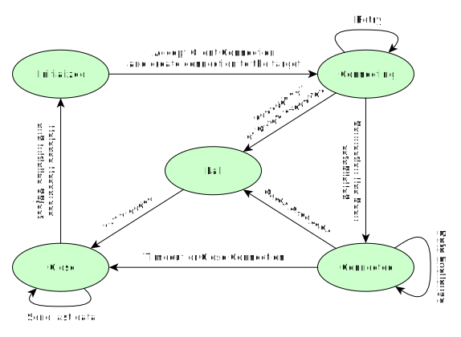
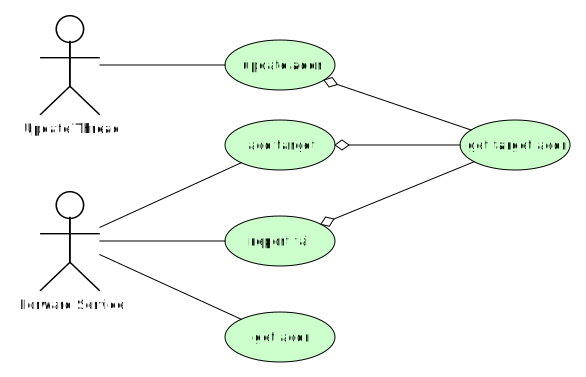

# Mapper

一个基于 Linux EPOLL Edge-Triger 的迷你端口转发服务器模型 。

<!-- TOC -->

- [1. 前言](#1-前言)
- [2. 系统框架](#2-系统框架)
    - [2.1. Top View](#21-top-view)
    - [2.2. 数据结构说明](#22-数据结构说明)
        - [2.2.1. 会话结构体](#221-会话结构体)
    - [2.3. 状态机](#23-状态机)
    - [2.4. Target Manager](#24-target-manager)
- [3. 其它](#3-其它)
    - [3.1. 编译、运行](#31-编译运行)
    - [3.2. config.json](#32-configjson)
    - [3.3. 第三方库](#33-第三方库)
    - [3.4. 推荐列表](#34-推荐列表)

<!-- /TOC -->

## 1. 前言

此项目用于在 Linux 环境下实现一个小型、高效的基于 EPOLL 边缘事件触发的端口转发服务器。

## 2. 系统框架

### 2.1. Top View

略

### 2.2. 数据结构说明

#### 2.2.1. 会话结构体

会话结构体 (SessionBlk_t) 用于保存与一个会话相关的所有信息，其中包括：

- 状态机
- 套接字：包括南向（至客户端）与北向（至后台服务器）
- 缓冲区：包括南向缓冲区及北向缓冲区
- 其他相关数据对象（如：同步对象等）

具体数据结构定义请参阅相关代码，在此不再复述。

### 2.3. 状态机

会话结构体中的状态机定义如下图所示:



### 2.4. Target Manager

Target Manager 的用力图如下所示:



## 3. 其它

### 3.1. 编译、运行

```sh
mkdir -p build
cd build
cmake .. && make

./mapper -c config.json -s 128 -m 1022:192.168.2:22 -m 1080:192.168.1.2:80
```

### 3.2. config.json

```json
{
  "log": {
    // sink: console, file
    // level: trace, debug, info, warn, error, critical
    // file: log file name

    "sink": "console",
    "level": "info",
    "file": "mapper.log"
  },
  "service": {
    "forward": [
      // syntac: [[protocol]:interface]:service port:target addr:targetport
      //    protocol: tcp|udp
      //    interface: any|lo|interface name
      //    target addr: ip, host name or domain name

      "8000:127.0.0.1:8080",
      "any:8001:127.0.0.1:8081",
      "lo:8002:127.0.0.1:8082",
      "tcp:lo:8003:127.0.0.1:8083",
      "udp:lo:8003:localhost:8083"
    ],
    "setting": {
      "timeout": {
        // unit: second

        "connect": 3,
        "session": 180,
        "release": 3,
        "udp": 3
      },
      "buffer": {
        // unit: mega bytes

        "size": 1024,
        "perSessionLimit": 1
      }
    }
  }
}
```

### 3.3. 第三方库

在本项目中用到的第三方库有：

- spdlog: [https://github.com/gabime/spdlog](https://github.com/gabime/spdlog)

### 3.4. 推荐列表

- 此项目中配图多为通过 yEd ([https://www.yworks.com](https://www.yworks.com)) 绘制。此工具小巧灵活，方便好用，推荐之。
- 虽然对 M\$ 一直不怎么感冒，但他家可在 Linux 下使用的 VSCode 真不错：[https://code.visualstudio.com](https://code.visualstudio.com)
